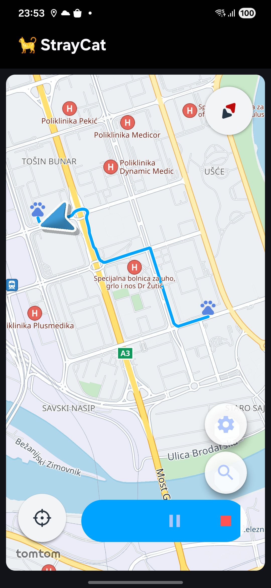

  
  
  # StrayCat 🐱
  
  **Location Simulation & GPS Tracking for Android**
  
  
  
  
  

---

## Overview

StrayCat is a Android application for location simulation and GPS tracking.
Perfect for testing location-based features and route simulations.

  

### Features

- 🎮 **Full Playback Control** - Start, pause, resume, and stop
- 📍 **Route Simulation** - Replay predefined routes with realistic timing using TomTom Routing SDK
- ⚙️ **Configurable** (TODO) - Speed multiplier, interpolation, noise injection, looping, and more
- 🔄 **Map display** - via TomTom Maps SDK

#### GPS Configuration
- **Minimum Time Interval** - Minimum time between location updates
- **Minimum Distance** - Minimum distance for location updates

#### Simulation Configuration (TODO)
- **Speed Multiplier** - Control playback speed (0.1x - 10x)
- **Loop Mode** - Continuously replay routes
- **Realistic Timing** - Use actual route timing vs fixed intervals
- **Interpolation** - Smooth transitions between points
- **Noise Level** - Add GPS signal variance (meters)
For detailed architecture documentation, see [Architecture Guide](./docs/ARCHITECTURE.md).

## Tech Stack

- **Language:** Kotlin 2.0.21
- **UI:** Jetpack Compose
- **Maps:** TomTom Maps SDK
- **Async:** Kotlin Coroutines & Flow
- **Architecture:** MVVM + Clean Architecture adhering to DDD principles
- **Min SDK:** Android 8.0 (API 26)

## Getting Started

### Prerequisites

- Android Studio Hedgehog or later
- Android device or emulator with API 26+
- Location permissions enabled

### Permissions

The app requires the following permissions:
- **Location Access** - For GPS tracking
- **Foreground Service** - For background operation

Permissions are requested at runtime on first launch.

## Usage

### Basic Controls

1. **Start** - Begin location tracking or simulation
2. **Pause** - Temporarily suspend updates (state preserved)
3. **Resume** - Continue from where you paused
4. **Stop** - End current session

To begin simulation, long-press on the map to set origin and destination points, which will generate a route.

To clear and start over, long-press on the map again after a route has been generated.

## Documentation

## Roadmap

### v1.0 (Current)
- ✅ Route simulation with replay
- ✅ GPS location tracking
- ✅ Pause/resume functionality
- ✅ Speed control and looping
- ✅ Error handling and recovery
- ✅ Comprehensive documentation

### TODO
- 🚧 Speed multiplier UI
- 🚧 Loop mode toggle
- 🚧 Realistic timing option
- 🚧 GPS noise injection
- 🚧 Route interpolation (maybe)
- 🚧 More elaborate testing strategy
- 🚧 Add unit and integration tests
- 🚧 Enhanced UI controls

## License

This project is licensed under the MIT License - see the [LICENSE](LICENSE) file for details.

**Built with ❤️ and Kotlin**

**Status:** Testing-Ready  
**Last Updated:** January 8, 2026  
**Version:** 1.0

