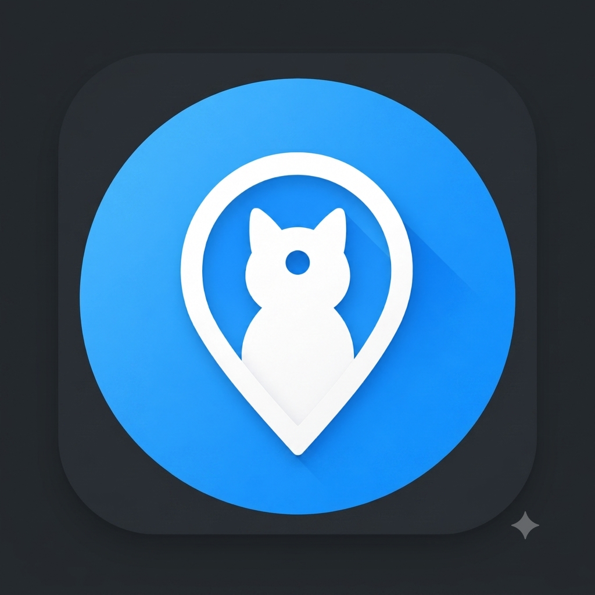
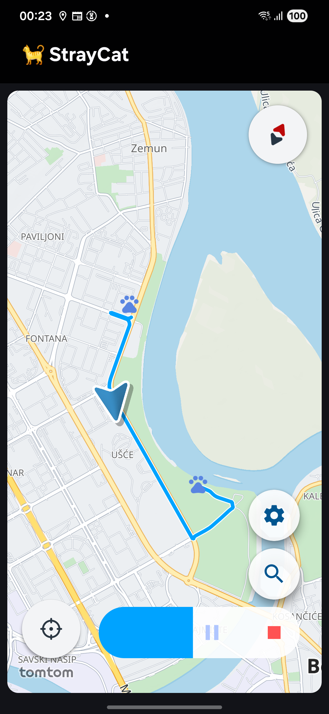

  
  
  # StrayCat 🐱
  
  **Location Simulation & GPS Tracking for Android**
  
  
  
  
  

---

> [!NOTE]
> This has started as a final project on [Coroutines Mastery 2025](https://coroutinesmastery.com/)

## Overview

StrayCat is a Android application for location simulation and GPS tracking.
Perfect for testing location-based features and route simulations.

  

### Features

- 🎮 **Full Playback Control** - Start, pause, resume, and stop
- 📍 **Route Simulation** - Replay predefined routes with realistic timing using TomTom Routing SDK
- ⚙️ **Configurable** (TODO) - Speed multiplier, interpolation, noise injection, looping, and more
- 🔄 **Map display** - via TomTom Maps SDK
- 🔍 **Search Locations** - Find points of interest using Google Places Search SDK

#### Simulation Configuration
- **Speed Multiplier** - Control playback speed (0.1x - 10x)
or
- **Delay** - Add a delay between location updates (in seconds)
- **Loop Mode** - Continuously replay the simulation
- **Realistic Timing** - Use actual route timing vs fixed intervals
- **Noise Level** - Add GPS signal variance (in meters)

## Getting Started

### Prerequisites
- Android device or emulator with API 26+
- Location permissions enabled

### Permissions

The app requires the following permissions:
- **Location Access** - For GPS tracking
- **Foreground Service** - For background operation

Permissions are requested at runtime on first launch.

## Usage

### Basic Controls

1. **Start** - Begin location tracking or simulation
2. **Pause** - Temporarily suspend updates (state preserved)
3. **Resume** - Continue from where you paused
4. **Stop** - End current session

To begin simulation, long-press on the map to set origin and destination points, which will generate a route.

To clear and start over, long-press on the map again after a route has been generated.

## Roadmap

### v1.2 (Current)
- ✅ Route simulation with replay
- ✅ GPS location tracking
- ✅ Pause/resume functionality
- ✅ Speed control and looping
- ✅ Error handling and recovery
- ✅ Start with documentation
- ✅ Speed multiplier UI
- ✅ Loop mode toggle
- ✅ Realistic timing option
- ✅ GPS noise injection

### TODO

- 🚧 More elaborate testing strategy
- 🚧 Enhanced UI controls
- 🚧 Comprehensive documentation

## License

This project is licensed under the MIT License - see the [LICENSE](LICENSE) file for details.

